# 🚦 Reinforcement Learning-Based Intelligent Traffic Control System

> **A complete AI system that teaches traffic lights to think — using Deep Reinforcement Learning to minimize congestion across road networks of any size.**

---

## 📖 Table of Contents

1. [What Is This Project? (For Complete Beginners)](#1-what-is-this-project-for-complete-beginners)
2. [The Problem We're Solving](#2-the-problem-were-solving)
3. [How Does AI Control Traffic? (Intuitive Explanation)](#3-how-does-ai-control-traffic-intuitive-explanation)
4. [Core AI Concepts Used (Plain English)](#4-core-ai-concepts-used-plain-english)
5. [Project Architecture & File Structure](#5-project-architecture--file-structure)
6. [System Design Choices](#6-system-design-choices)
7. [Deep Q-Networks (DQN) — Experiments](#7-deep-q-networks-dqn--experiments)
   - [Single Intersection](#71-single-unidirectional-intersection)
   - [Linear Network](#72-linear-network-intersections)
   - [Grid Square Network](#73-grid-square-network-intersections)
   - [Multi-thread Version](#74-multi-thread-version)
   - [One Agent Per Intersection](#75-one-agent-per-intersection)
8. [Deep Deterministic Policy Gradients (DDPG) — Experiments](#8-deep-deterministic-policy-gradients-ddpg--experiments)
   - [DDPG Single Intersection](#81-ddpg-single-bidirectional-intersection)
   - [DDPG Linear Network](#82-ddpg-linear-network)
   - [DDPG Grid Network](#83-ddpg-grid-network)
9. [Getting Started (Installation & Running)](#9-getting-started-installation--running)
10. [Running the Live Demo](#10-running-the-live-demo)
11. [Advanced Topics: Training Parallelism](#11-advanced-topics-training-parallelism)
12. [Why RL Is Hard (and How We Address It)](#12-why-rl-is-hard-and-how-we-address-it)

---

## 1. What Is This Project? (For Complete Beginners)

Imagine you're stuck at a red light at 2 AM with no cars around. Frustrating, right? Traditional traffic lights run on **fixed timers** — they switch every X seconds regardless of actual traffic. They don't "see" the real world.

This project builds a **thinking traffic light system**. Instead of fixed timers, an AI agent observes how many cars are waiting on each road and decides **when to change the light** to keep traffic flowing as smoothly as possible.

The AI learns this skill through **trial and error**, just like how you learned to ride a bike — it tries different things, sees what works, and gradually improves. This technique is called **Reinforcement Learning (RL)**.

**In short:** We train AI agents to control traffic lights across intersections, from a single crossing to large grid-shaped city networks — and the AI learns entirely on its own through experience.

---

## 2. The Problem We're Solving

### Traditional Traffic Lights ❌
- Use fixed timing cycles (e.g., 30s green, 10s yellow, 30s red)
- Don't adapt to real-time traffic density
- One congested intersection can back up an entire network
- Waste time even when roads are empty

### Our AI System ✅
- Observes real-time car counts on each road
- Decides dynamically: *Should I change the light now, or keep it green?*
- Learns coordination across multiple intersections
- Minimizes total waiting time across the entire network

This matters at city scale. In large cities, smarter traffic control could reduce commute times, cut fuel consumption, and lower emissions — all without building new roads.

---

## 3. How Does AI Control Traffic? (Intuitive Explanation)

### The Basic Loop

The AI works in a continuous **observe → decide → act → learn** cycle:

```
┌─────────────────────────────────────────────────────────┐
│                                                         │
│   🚗 Environment (Road Network)                         │
│        ↓  State (car counts, light colors)              │
│   🧠 AI Agent                                           │
│        ↓  Action (change light / keep light)            │
│   🚦 Traffic Light Changes                              │
│        ↓  Reward (did cars flow better?)                │
│   🧠 AI Agent learns from reward                        │
│        ↑  (cycle repeats thousands of times)            │
│                                                         │
└─────────────────────────────────────────────────────────┘
```

### State: What Does the AI "See"?

At each moment, the AI receives a **state** — a snapshot of the current situation:

| Input | Meaning |
|---|---|
| `Q1` | Number of cars waiting on Road 1 |
| `Q2` | Number of cars waiting on Road 2 |
| `S` | Current traffic light state (green/yellow/red) |

The traffic light has **4 possible states**:

<p align="center">

</p>

| State Code | Meaning |
|---|---|
| `0` | 🟢 Green for Road 1, 🔴 Red for Road 2 |
| `1` | 🔴 Red for Road 1, 🟢 Green for Road 2 |
| `2` | 🟡 Yellow for Road 1, 🔴 Red for Road 2 |
| `3` | 🔴 Red for Road 1, 🟡 Yellow for Road 2 |

> **Important:** Light states must follow a strict legal sequence. You can't jump from Green directly to Red — you must go through Yellow. The sequence is: `0 → 2 → 1 → 3 → 0`

### Action: What Can the AI Do?

The AI can only take **2 actions** at each step:

| Action Code | Meaning |
|---|---|
| `0` | **Change** — transition to the next state |
| `1` | **Keep** — stay in the current state |

### Reward: How Does the AI Know If It Did Well?

The AI receives a **reward signal** after each action — a number that tells it how good or bad its decision was. Typically:
- **Negative reward** if many cars are still waiting (bad — congestion)
- **Less negative / positive reward** if cars are flowing freely (good)

Over thousands of training iterations, the AI learns to take actions that **maximize total reward** — which means minimizing congestion.

---

## 4. Core AI Concepts Used (Plain English)

### 🔵 Reinforcement Learning (RL)
A type of machine learning where an agent learns by **interacting with an environment**. No labeled data needed — the agent discovers good strategies through trial, error, and reward signals.

Think of it like training a dog: you don't explain the rules, you just give treats when it does the right thing.

### 🔵 Deep Q-Network (DQN)
A neural network that learns to predict the **quality (Q-value)** of taking each action in a given state. "Deep" refers to using a deep neural network for this prediction.

- Input: current state (car counts + light state)
- Output: expected future reward for each possible action
- The AI picks the action with the **highest predicted reward**

### 🔵 Deep Deterministic Policy Gradient (DDPG)
A more advanced RL algorithm for situations with **continuous action spaces**. While DQN works with discrete actions (change / keep), DDPG can handle smoother, more realistic traffic variables (like the exact number of cars — 16, 8, etc. instead of just 0 or 1).

DDPG uses two networks:
- **Actor**: decides what action to take
- **Critic**: evaluates how good that action was

### 🔵 Replay Buffer
The AI doesn't learn from experience instantly. Instead, it stores recent experiences (state, action, reward, next state) in a **memory buffer** and samples random batches to learn from. This prevents the AI from "forgetting" old lessons or becoming biased to recent events.

### 🔵 Exploration vs. Exploitation
Early in training, the AI tries **random actions** to explore possibilities (exploration). Over time, it shifts to using what it has learned — picking the best-known action (exploitation). The balance is controlled by a parameter called **epsilon (ε)**, which decreases over training.

### 🔵 Q-Value
A number representing: *"If I'm in this situation and I take this action, how much total reward will I earn in the future?"* The AI learns to predict these values accurately and uses them to make decisions.

---

## 5. Project Architecture & File Structure

```
rl-intelligent-traffic-control/
│
├── app/                          # 🎮 Main runnable demo application
│   └── traffic_simulation.py     # Pygame-based live traffic visualization
│
├── assets/                       # 📁 All static resources
│   ├── images/                   # Diagrams, training plots, screenshots
│   │   ├── state_space.png           # Light state transition diagram
│   │   ├── intersection_single.png   # Single intersection layout
│   │   ├── linear_network.png        # Linear road network diagram
│   │   ├── linear_network_alt.png    # Alternate linear network view
│   │   ├── grid_network.png          # Grid network layout
│   │   ├── grid_2x2.png              # 2×2 grid simulation screenshot
│   │   ├── grid_4x4.png              # 4×4 grid simulation screenshot
│   │   ├── training_plot.png         # DQN training reward curve
│   │   ├── training_plot_alt.png     # DQN alternate training curve
│   │   ├── ddpg_single.png           # DDPG single intersection results
│   │   ├── ddpg_linear.png           # DDPG linear network results
│   │   ├── ddpg_grid.png             # DDPG grid network results
│   │   ├── ddpg_grid_alt.png         # DDPG grid alternate view
│   │   ├── demo.png                  # Simulation screenshot
│   │   └── single_intersection.png   # One-way two-queue diagram
│   │
│   └── docs/                     # 📄 Research PDFs
│
├── experiments/                  # 🧪 All RL experiment code
│   ├── single_intersection/      # Experiment 1: one intersection, 2 roads
│   ├── two_intersections/        # Experiment 2: 2 intersections (linear)
│   ├── grid_network/             # Experiment 3: grid road network
│   ├── multithread/              # Experiment 4: faster training with threads
│   ├── multi_agent/              # Experiment 5: one agent per intersection
│   ├── ddpg_single/              # Experiment 6: DDPG single intersection
│   ├── ddpg_linear/              # Experiment 7: DDPG linear network
│   └── ddpg_grid/                # Experiment 8: DDPG grid network
│
├── README.md                     # 📘 This file
├── PROJECT_DETAILS.md            # 📖 Deep theoretical notes
├── requirements.txt              # 📦 Python dependencies
├── LICENSE                       # ⚖️ License
└── .gitignore                    # Files excluded from git
```

### What's in Each Key Folder?

**`app/`** — The place to start if you just want to *see* something cool. Run the Pygame simulation and watch cars move through intersections in real time.

**`experiments/`** — The heart of the research. Each subfolder is a self-contained experiment with its own training and testing scripts. Start with `single_intersection` and work your way up.

**`assets/images/`** — All visual outputs from the experiments: network diagrams, training curves, simulation screenshots.

---

## 6. System Design Choices

Before diving into experiments, it helps to understand the key design decisions made when building an RL traffic system. These aren't fixed rules — they're choices with real tradeoffs.

### 6.1 Object Choice: What Is the "Thing" We Model?

**Option A: Intersection-based**
- The intersection is the central object
- Vehicles around it (within a range) belong to the intersection
- ✅ Good when you care about intersection-level metrics
- This project's original model uses this approach

**Option B: Vehicle-based**
- Each vehicle is an individual object
- Intersections are part of the vehicle's environment
- ✅ Good when you care about per-vehicle travel time
- Uses spatial zones to define when a vehicle "interacts" with an intersection

> **How to choose:** Ask yourself — do you need statistics about intersections, or about individual vehicles? Choose accordingly.

### 6.2 Agent Choice: One Brain or Many?

This is one of the most important design decisions.

#### Single Agent (Global Brain)
```
        [Single RL Agent]
       /        |        \
  Inter_1    Inter_2    Inter_3
```
- One agent controls the entire road network
- Has a **global view** — can achieve true global optimality
- ⚠️ Hard to train with large networks (massive state and action space)

#### Multiple Agents — No Interaction
```
  [Agent_1]   [Agent_2]   [Agent_3]
      |            |            |
  Inter_1      Inter_2      Inter_3
```
- Each intersection has its own agent
- Simple and scalable
- ⚠️ Each agent can only see its local surroundings → only reaches **local optimum**

#### Multiple Agents — With Interaction
```
  [Agent_1] ↔ [Agent_2] ↔ [Agent_3]
      |            |            |
  Inter_1      Inter_2      Inter_3
```
- Agents share information with neighbors
- Broader view than no-interaction → closer to global optimum
- ⚠️ More complex to implement and train
- All agents in this project can optionally share the same weights

> **Rule of thumb:** Start with a single agent for small networks. Scale to multi-agent with interaction for large city-scale networks.

---

## 7. Deep Q-Networks (DQN) — Experiments

All DQN experiments use **Python 3.5** and follow this pattern:
- `python <script>.py --train` to train the agent
- `python <script>.py --test` to evaluate the trained agent

---

### 7.1 Single Unidirectional Intersection

**Folder:** `experiments/single_intersection/`
**Script:** `python light_constr.py --train` or `--test`

#### What Is Being Modeled?

The simplest possible case: **one intersection, two one-way roads** (no left/right turns).

<p align="center">
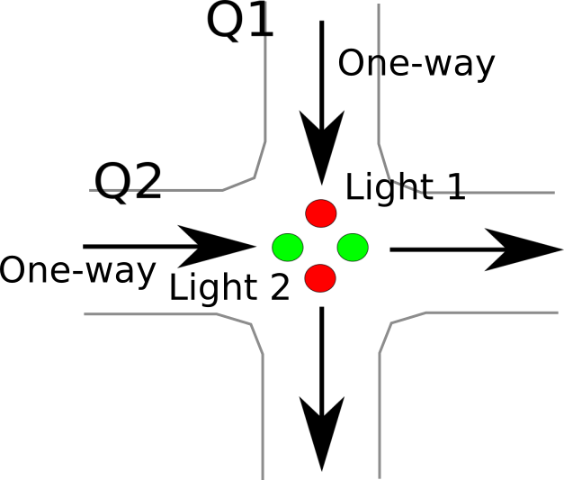
</p>

- Road 1 has `Q1` cars waiting
- Road 2 has `Q2` cars waiting
- The light is in state `S`
- The agent sees `[Q1, Q2, S]` and decides: change light or keep it?

#### How Training Works

1. Cars arrive randomly on each road each time step
2. When a light is green, some cars pass through; when red, they queue up
3. The agent is penalized for long queues
4. Over tens of thousands of steps, it learns to balance green time between roads based on queue lengths

#### Training Result

<p align="center">
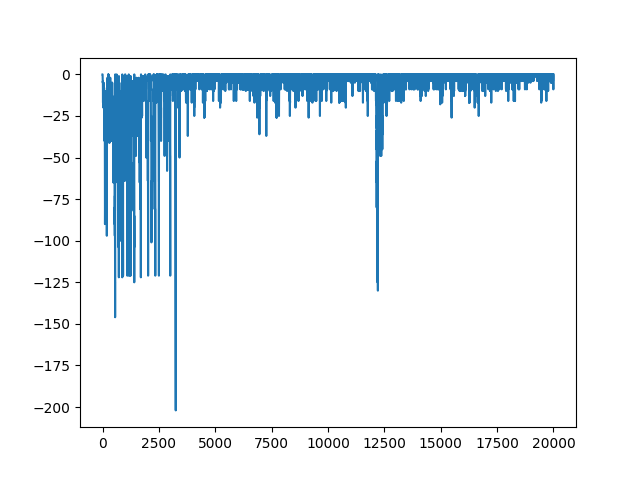
</p>

The reward increases over training — the agent is learning to keep queues short.

---

### 7.2 Linear Network Intersections

**Folder:** `experiments/two_intersections/`
**Script:** `python lights.py --train` or `--test`

#### What Is Being Modeled?

Multiple intersections arranged in a **straight line**:

<p align="center">
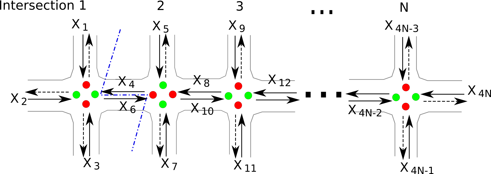
</p>

- Dashed lines = outgoing roads (we don't care much about these)
- Solid lines = incoming roads where queues build up
- A single agent controls all lights simultaneously

#### Visualized Simulation

<p align="center">
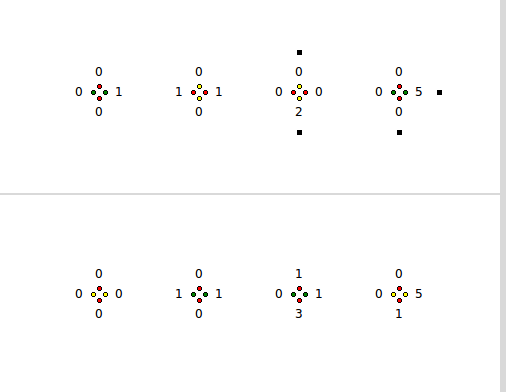
</p>

Here's how to read the simulation:
- 🟢 Green / 🔴 Red / 🟡 Yellow — light colors as expected
- **Black rectangle** = a new car arriving at the edge of the network
- **Numbers** = current car count on that road segment
- **Top image** = state before transition
- **Bottom image** = state after transition

When a light turns green, the car count on that road decreases (cars pass through). When a black rectangle appears, the count on that road increases by one.

#### Training Result

<p align="center">
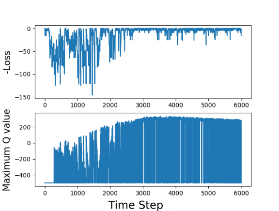
</p>

---

### 7.3 Grid Square Network Intersections

**Folder:** `experiments/grid_network/`
**Script:** `python lights.py --train`

#### What Is Being Modeled?

A full **grid of intersections** — like city blocks. This is the most realistic topology.

<p align="center">
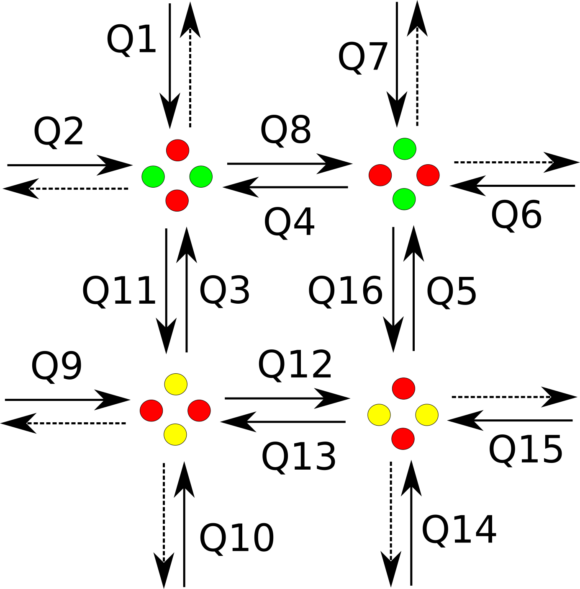
</p>

Tested on:
- **2×2 grid** (4 intersections)
- **4×4 grid** (16 intersections)

#### Simulation Screenshots

2×2 grid result:
<p align="center">
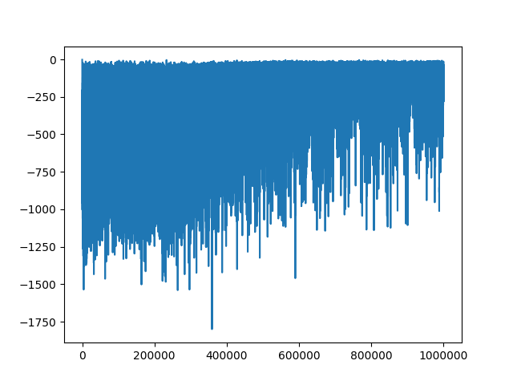
</p>

4×4 grid result:
<p align="center">
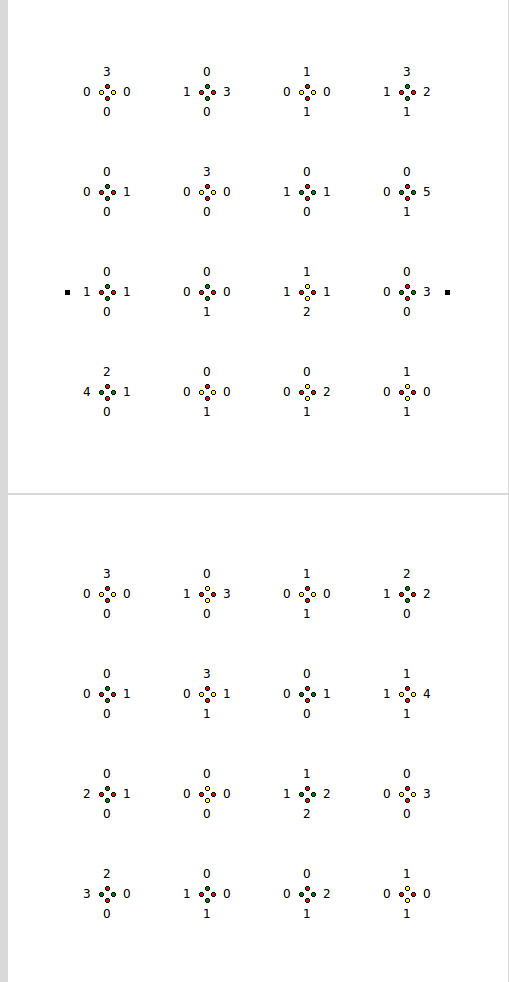
</p>

The larger the grid, the harder the training problem — but the same DQN approach handles it.

---

### 7.4 Multi-Thread Version

**Folder:** `experiments/multithread/`
**Script:** `python lights.py --train` or `--test`

#### Why Does This Exist?

Training RL agents involves two expensive steps:
1. **Sampling** — running the simulation to collect experiences (CPU-heavy)
2. **Backpropagation** — updating the neural network weights (GPU-heavy)

In standard single-thread training, these run one after the other. If CPU sampling is the bottleneck, the GPU sits idle. This version uses **multiple threads** to run several simulation environments in parallel, feeding experiences to a single GPU training process — significantly faster.

> **Note:** Only sampling is parallelized. Network weight updates still happen in a single process, because multiple processes updating the same weights simultaneously would create conflicts (race conditions).

---

### 7.5 One Agent Per Intersection

**Folder:** `experiments/multi_agent/`
**Script:** `python lights_re.py --train` or `--test`

#### What's Different Here?

Instead of one global agent controlling all intersections, **each intersection has its own dedicated agent**. All agents share the same neural network weights (parameter sharing).

Two reward strategies are tested:
- **`lights.py`**: All agents share one global reward (how well is the whole network doing?)
- **`lights_re.py`**: Each agent gets its own local reward (how well is my intersection doing?)

#### When Is This Better?

For small networks, a single global agent is fine. But for large city-scale networks, having one agent observe everything becomes computationally impractical. Local agents scale much better — the tradeoff is that they may not achieve the globally optimal solution.

---

## 8. Deep Deterministic Policy Gradients (DDPG) — Experiments

### Why DDPG Instead of DQN?

DQN works with **discrete actions** (a small set of choices). DDPG handles **continuous action spaces** — where decisions can be any value in a range. DDPG also uses more realistic traffic numbers:

| Feature | DQN Version | DDPG Version |
|---|---|---|
| Car counts | 0 or 1 | 8, 16, etc. (realistic) |
| Action space | Discrete (change/keep) | Continuous |
| Roads | Unidirectional | Bidirectional |
| Road types | Same | Main road + Branch road |

All DDPG experiments distinguish between:
- **Main road (direction 2)**: Higher traffic volume, higher priority
- **Branch road (direction 1)**: Lower traffic volume, lower priority

### General DDPG Commands

```bash
# Training
python -m run.py --alg=ddpg --num_timesteps=1e4 --train

# Testing
python -m run.py --alg=ddpg --num_timesteps=1e4 --test

# Resume training from last checkpoint
python -m run.py --alg=ddpg --num_timesteps=1e4 --retrain
```

---

### 8.1 DDPG Single Bidirectional Intersection

**Folder:** `experiments/ddpg_single/`

Models a **4-road intersection** (bidirectional traffic — cars can come from and go in all 4 directions).

<p align="center">
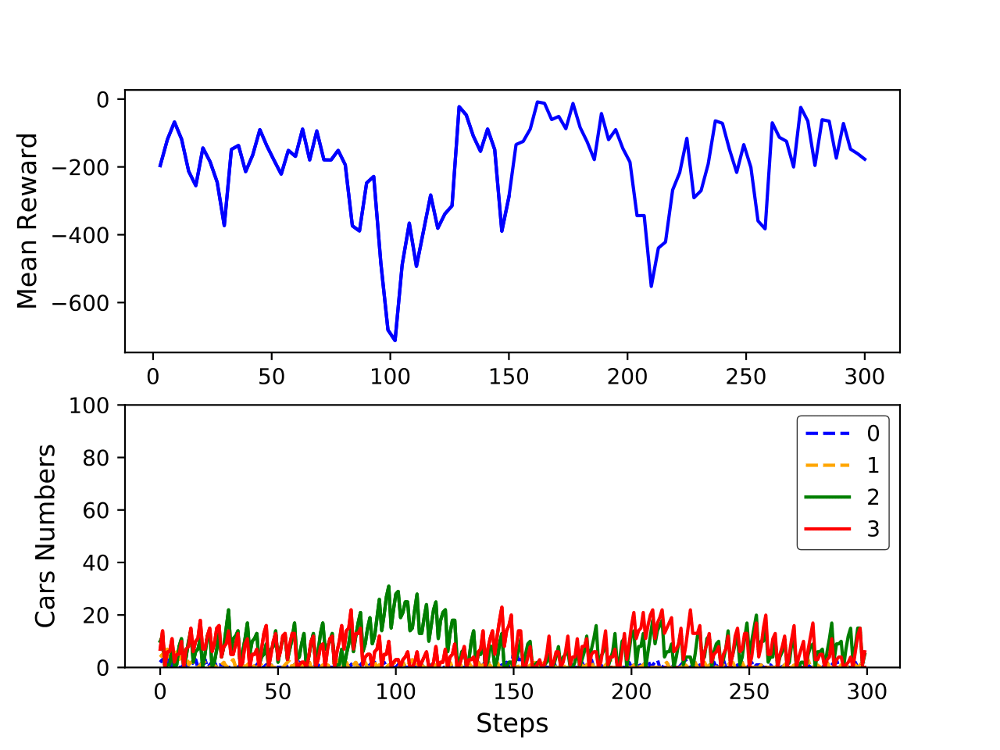
</p>

This is more realistic than the DQN single intersection because:
- Traffic flows in both directions
- Main vs. branch road priorities are modeled
- Car counts are realistic integers (not just 0/1)

---

### 8.2 DDPG Linear Network

**Folder:** `experiments/ddpg_linear/`

Tests a **10×1 linear network** (10 intersections in a line) using DDPG.

<p align="center">
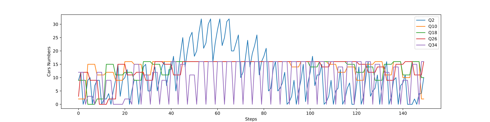
</p>

The DDPG approach handles larger realistic numbers better in linear networks where car counts per road can be significant.

---

### 8.3 DDPG Grid Network

**Folder:** `experiments/ddpg_grid/`

Tests a **10×5 grid network** (50 intersections!) using DDPG — the largest scale experiment in this project.

<p align="center">
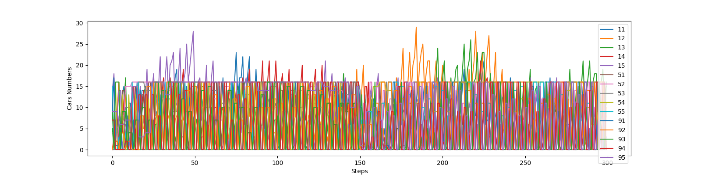
</p>

At this scale, the coordination challenge becomes significant. DDPG's ability to handle continuous, fine-grained decisions pays off in large grid networks.

---

## 9. Getting Started (Installation & Running)

### Prerequisites

- Python 3.5 (required for compatibility with this codebase)
- pip
- Git

### Step 1: Clone the Repository

```bash
git clone https://github.com/itsmohitshekhawat/rl-intelligent-traffic-control.git
cd rl-intelligent-traffic-control
```

### Step 2: Install Dependencies

```bash
pip install -r requirements.txt
```

The main libraries used include:
- `numpy` — numerical computations
- `tensorflow` or `pytorch` — neural network training
- `pygame` — simulation visualization
- `matplotlib` — training curve plots

### Step 3: Run Your First Experiment

Start with the simplest case — single intersection DQN:

```bash
cd experiments/single_intersection
python light_constr.py --train
```

After training, test the learned policy:

```bash
python light_constr.py --test
```

### Running All Experiments

| Experiment | Folder | Command |
|---|---|---|
| Single DQN | `single_intersection/` | `python light_constr.py --train/test` |
| Linear DQN | `two_intersections/` | `python lights.py --train/test` |
| Grid DQN | `grid_network/` | `python lights.py --train` |
| Multi-thread | `multithread/` | `python lights.py --train/test` |
| Multi-agent | `multi_agent/` | `python lights_re.py --train/test` |
| DDPG single | `ddpg_single/` | `python -m run.py --alg=ddpg --num_timesteps=1e4 --train` |
| DDPG linear | `ddpg_linear/` | `python -m run.py --alg=ddpg --num_timesteps=1e4 --train` |
| DDPG grid | `ddpg_grid/` | `python -m run.py --alg=ddpg --num_timesteps=1e4 --train` |

---

## 10. Running the Live Demo

To see a real-time visual simulation of the trained agent controlling traffic:

```bash
cd app
python traffic_simulation.py
```

This opens a **Pygame window** showing:
- Cars represented as colored blocks moving through roads
- Traffic lights changing color based on the AI's decisions
- Queue lengths updating in real time
- The AI making smarter decisions as it's been trained

> **Tip:** Watch how the AI responds when you imagine traffic surging on one road — it learns to give that road more green time proportionally.

---

## 11. Advanced Topics: Training Parallelism

This is a deeper topic for readers who want to understand how to speed up RL training.

### The Bottleneck Problem

RL training involves two phases:
1. **Environment sampling** (CPU): Run the simulation, collect `(state, action, reward, next_state)` tuples
2. **Neural network update** (GPU): Use those tuples to update network weights via gradient descent

In simple training, these alternate. If sampling is slow, the GPU is underutilized.

### Solution: Parallel Sampling

Run **multiple copies of the environment simultaneously** on different CPU threads. Each thread collects experiences independently and feeds them into a **shared replay buffer**. The GPU pulls batches from this buffer and trains continuously.

```
Thread 1 → [Env Copy 1] → experiences ─┐
Thread 2 → [Env Copy 2] → experiences ─┼─→ Replay Buffer → GPU Training
Thread 3 → [Env Copy 3] → experiences ─┘
```

### Why Not Parallelize the Network Update Too?

The network can only be updated by **one process at a time** — parallel gradient updates on shared weights cause conflicts (each process would overwrite the others' updates). This is why only the sampling step is parallelized here.

> **For advanced readers:** Approaches like A3C (Asynchronous Advantage Actor-Critic) do parallelize network updates using asynchronous gradients, but that's a more complex architecture not used here.

---

## 12. Why RL Is Hard (and How We Address It)

### The Comparison Problem

Why does it take thousands of training steps for an RL agent to learn something a human could figure out intuitively in minutes?

The key difference is **prior knowledge and abstraction**:

A human looking at a congested intersection immediately thinks:
> "Road 1 has 20 cars backed up, Road 2 has 2. Obviously give Road 1 a longer green."

A machine sees:
> `[0,1,0,2,0,0,0,2,0,3,0,2...]` — raw numbers with no built-in meaning

Humans unconsciously perform **extraction and structuralization** before reasoning. We filter noise, recognize patterns, and apply prior knowledge about traffic, queues, fairness, and time. This is powered by **attention** — focusing on what matters.

Machines lack this prior knowledge. They learn structure from scratch, which is why they need so many more examples.

> **A fairer comparison would be:** Give a human the raw number sequence with no context, no knowledge of what the numbers mean, no prior knowledge of traffic — just input/output pairs. Then compare learning speed. That human would likely need just as many examples as the machine.

### What Makes RL Especially Slow

1. **Sparse rewards**: The agent only learns if something good or bad happens — and in traffic, it might take many steps before the impact of a decision is visible.
2. **High-dimensional state space**: In a grid of 10×5 intersections, the state includes hundreds of numbers — the agent must learn which ones matter.
3. **Non-stationarity**: In multi-agent settings, as one agent improves, the environment changes for all others — making training an ever-moving target.

### Our Approaches to These Challenges

- **Replay buffer**: Random sampling from stored experience breaks temporal correlations and speeds learning
- **Multi-thread sampling**: More experience collected per unit time
- **Shared weights in multi-agent**: All agents benefit from every intersection's experience
- **DDPG for continuous variables**: More expressive than DQN for realistic traffic modeling
